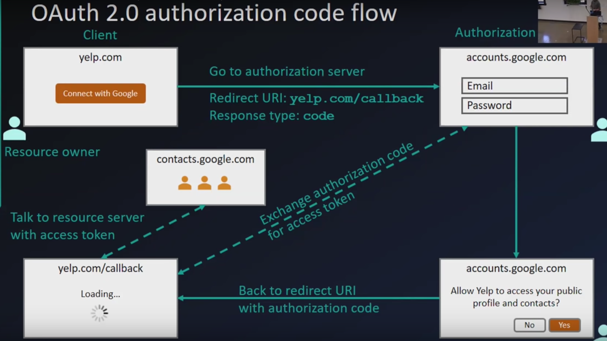
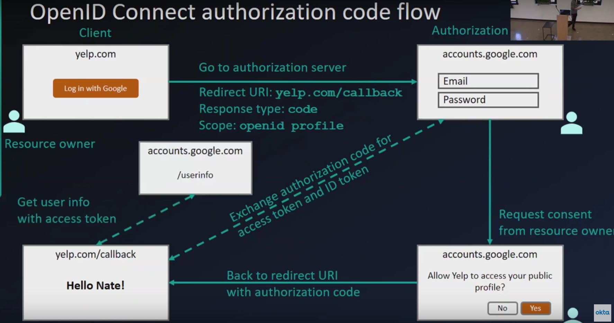

OAuth2.0 is a process/protocol for granting access to a third party to resources that you own. Basically when you are on a web site or app and that site asks if they can have some kind of access to your contacts or calendar or whatever. 

OpenID is a protocol that sits on top of OAuth to enable authentication. If you are building a web site and want to allow your users to sign in using Facebook or Google or whoever. OpenID adds some user identity information. OAuth should not be used on its own for authentication.

The OAuth process

OpenID flow is very similar, basically because it is just OAuth with some ID stuff added in.

A good overview of Oauth and OpenID on YouTube. https://www.youtube.com/watch?v=996OiexHze0

