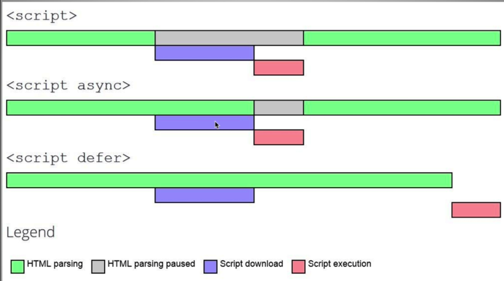

# Tips for web site performance

## network transfer optimizations

1. minimize your html, css and js files.

Optimize images

- use the appropriate image format for the job
  - animations - use a gif
  - colorful images - use a jpeg
  - simple icons or logos - use an SVG
  - https://99designs.com/blog/tips/image-file-types/
  - https://www.sitepoint.com/gif-png-jpg-which-one-to-use/
  - image size analysis tool https://pageweight.imgix.com/
- reduce png files with the TinyPNG site
- Reduce jpg files with the JPEG-optimizer site
- Choose simple illustrations over highly detailed photos
- Always lower jpeg image quality
- Resize the image based in the size that it will be displayed. 500px wide use a 500px wide image.
- Use media queries to display different sized images for different devices.
- Use CDN's like Imigx or CloudFlare. They can optimize images automatically among other things.
- Remove image metadata. EXIF. www.verexif.com

## Critical Render Path


- Load `<style>` in head. The css Object Model is required to render.

- Load `<script>` right before the /body tag. If the js is in the head the render will wait for the js to download. JS needs the html and css parsing to finish prior to running. So having js at the bottom gives your html, css and media a chance to download and render before the js downloads and runs.

- Load only what is needed. Clean up your css no unnecessary or unused css.

- Above the fold loading. Get just the css needed to style the above the fold stuff. You can have two css files, one that gets loaded in the head and the below the fold css that gets loaded after the initial render. It can be done like this..

```javascript
//At the bottom of the html
<script type="text/javascript">
    const loadStyleSheet = src => {
        if(document.createStylesheet) {
            document.createStylesheet(src)
        }  else {
            const stylesheet = document.createElement('link');
            stylesheet.href = src;
            stylesheet.type = 'text/css';
            stylesheet.rel = 'stylesheet';
            document.getElementsByTagName('head')[0].appendChild(stylesheet)
        }
    }
    window.onload - function() {
        loadStyleSheet('./style.css')
    }
</script>
</body>
```

- Media attributes. You can do these in your html files as well. As example you can put the following in your `<head>` tag to only load this css on screens over 500px. media= will always default to media="all".

```javascript
<link rel="stylesheet" href="./style2.css" media="only screen and (min-width:500px)">
```

- Less specificity. The less specific your css the less processing the browser will have to do and the fewer characters that will be needed to download. Not a huge performance increase but it is something.

## Javascript

- Load scripts asynchronously

  Javascript will download and execute immediately, blocking further downloading of html, css, etc.

  

- Defer loading of scripts

  The `<script async>` and `<script defer>` tags should be used for scripts that do not manipulate the dom or css. Perfect for things like Google Analytics.

  Defer acts very much the same as putting your scripts at the bottom just above the /body tag.

  - Normal execution `<script>`
    _This is the default behavior of the `<script>` element. Parsing of the HTML code pauses while the script is executing. For slow servers and heavy scripts this means that displaying the webpage will be delayed._
  - Deferred execution `<script defer>`
    _Simply put: delaying script execution until the HTML parser has finished. A positive effect of this attribute is that the DOM will be available for your script. However, since not every browser supports defer yet, don’t rely on it!_
  - Asynchronous execution `<script async>`
    _Don’t care when the script will be available? Asynchronous is the best of both worlds: HTML parsing may continue and the script will be executed as soon as it’s ready. I’d recommend this for scripts such as Google Analytics._

- Minimize DOM manipulation

- Avoid long running Javascript
