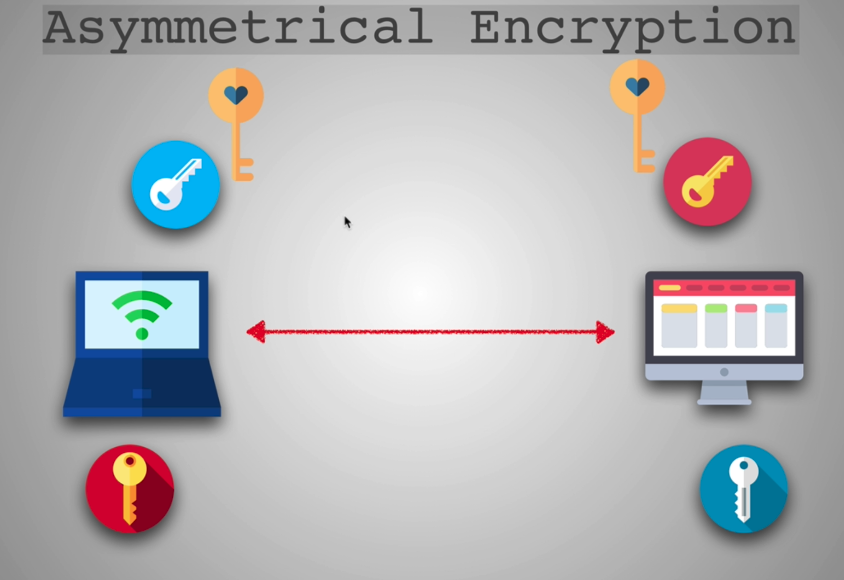

# SSH

SSH (secure shell) is just another protocol like http, ftp, etc. SSH allows us to share files and control computers over the Internet in an encrypted form. 

On Linux or Apple just use the ssh command, if on Windows use Putty.

Example, to log in to one of the Raspberry Pis and login as the user 'pi' use this command:

```ssh 192.168.1.126 -l pi ```

or

```ssh pi@192.168.1.126```

## Techniques used in SSH

### Symmetrical Encryption

Symmetrical encryption uses a single key to encrypt and to decrypt. The key is never shared, publicly or privately. It uses a 'key exchange' using asymmetrical encryption.

### Asymmetrical Encryption

Asymmetrical encryption is only used by ssh to exchange the shared key. This is known as the Difiie Hellman Key Exchange. The symmetrical encrypted key that gets used by ssh gets generated by this 'key exchange'.

Each end, the client and the host, will generate a public/private key pair. They will then trade their public keys. Then using the other ends public key and their private key they will each generate an identical 'shared key.' The cool part is that the shared key is never shared, it is never sent over the internet or sent anywhere. Each end, client and host, are able to generate the key using their private key and the other ends public key. So it is very difficult for a man in the middle to ever get the key.



So this seems very secure so far. However, a person could potentially still sit in the middle and send iits own public keys to both the client and the host and generate shared keys with each. As the host sends something the man in the middle will decrypt it then encrypt it using the clients key and so on. This is where hashing comes in.

### Hashing

A hash gets created using the secret key, the packet sequence number and the message contents. One end sends the hash, the other end will try to generate a hash using the same inputs and if the hashes match that pretty much ensures that the sender is using the same secret key.

### RSA

To gen an rsa public/private key pair with Linux:

```
cd ~
cd .ssh
ssh-keygen -t rsa -b 2048
```

The -t is for 'type', the -b if for bytes. It will ask you for a keyname and a passphrase.

## SSH on Github

